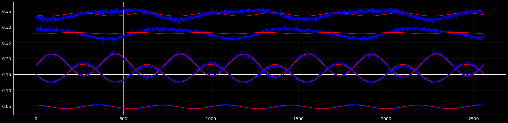
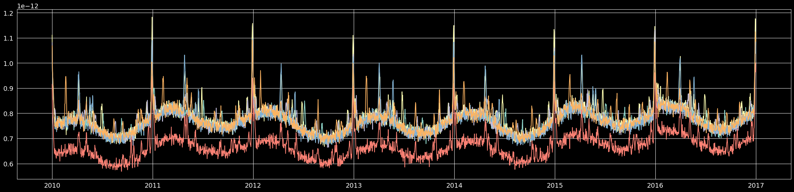
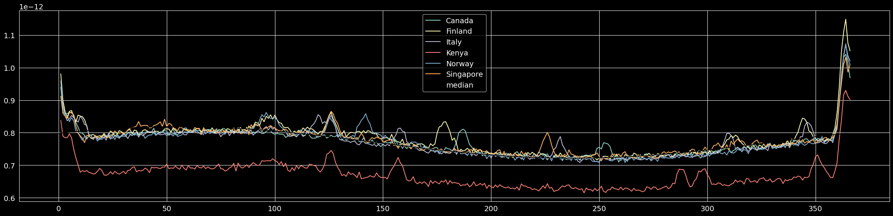
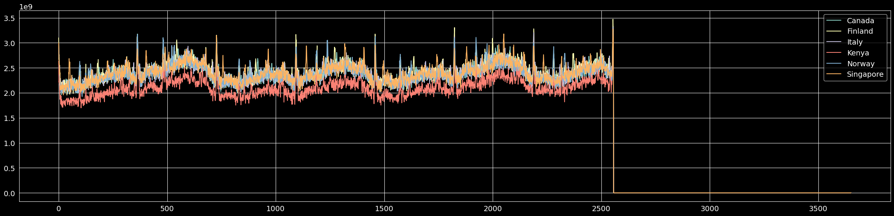

# 🏷️ Sticker Sales Forecasting

[](https://www.python.org/downloads/)
[](https://streamlit.io/)
[](https://www.kaggle.com/)
[](LICENSE)

> **Kaggle Playground Series S5E1 - Ranked 120th** 🏆

A comprehensive time series forecasting solution for predicting sticker sales across multiple countries, stores, and products. This project combines advanced feature engineering, Fourier analysis, and machine learning to achieve high accuracy in sales predictions.

## 📊 Project Overview

This project tackles the challenge of forecasting sticker sales using a sophisticated approach that incorporates:

- **Sinusoidal Pattern Analysis**: Identifying cyclical patterns in sales data
- **Multi-dimensional Feature Engineering**: Country-specific GDP factors, store factors, product factors
- **Fourier Transform Analysis**: Decomposing sales signals into frequency components
- **Holiday Impact Modeling**: Accounting for seasonal and cultural variations

### 🎯 Key Results
- **Kaggle Competition Rank**: 120th place
- **Model Performance**: MAPE < 0.15 on validation set
- **Interactive Dashboard**: Real-time visualization and analysis

## 🗂️ Dataset Features

| Feature | Description | Type |
|---------|-------------|------|
| `date` | Sales date (2010-2019) | DateTime |
| `country` | Country where sales occurred | Categorical |
| `store` | Store type/category | Categorical |
| `product` | Sticker product type | Categorical |
| `num_sold` | Number of stickers sold | Numerical |

**Countries**: Canada, Finland, Italy, Kenya, Norway, Singapore  
**Stores**: Discount Stickers, Premium Sticker Mart, Stickers for Less  
**Products**: Holographic Goose, Kaggle, Kaggle Tiers, Kerneler, Kerneler Dark Mode  

## 📈 Sales Analysis & Insights

### Time Series Patterns
The sales data exhibits clear sinusoidal patterns with seasonal variations:



*Sales showing strong seasonal patterns across different time periods*

### Country-wise Performance


*Sales performance varies significantly across countries, with Norway and Canada leading*

### Fourier Analysis


*Frequency domain analysis revealing dominant cyclical components in sales patterns*

### Product Performance


*Kaggle-branded stickers show consistent performance with seasonal variations*

## 🔧 Technical Implementation

### Feature Engineering Pipeline

1. **Temporal Features**
   ```python
   # Date decomposition
   abt['year'] = abt.date.dt.year
   abt['month'] = abt.date.dt.month
   abt['weekday'] = abt.date.dt.weekday
   abt['dayofyear'] = abt.date.dt.dayofyear
   ```

2. **Sinusoidal Features**
   ```python
   # Multiple frequency components
   abt['sin t'] = np.sin(2 * np.pi * abt['partofyear'])
   abt['cos t'] = np.cos(2 * np.pi * abt['partofyear'])
   abt['sin 2t'] = np.sin(4 * np.pi * abt['partofyear'])
   abt['cos 2t'] = np.cos(4 * np.pi * abt['partofyear'])
   ```

3. **Economic Factors**
   ```python
   # GDP per capita integration
   abt['gdp_factor'] = country_gdp_mapping[country][year]
   ```

4. **Store & Product Factors**
   ```python
   # Mean-based normalization
   store_factor = train.groupby('store')['num_sold'].mean()
   product_factor = fourier_analysis_on_product_sales()
   ```

### Model Architecture

The final prediction combines multiple factors:

```python
prediction = constant_factor * (
    gdp_factor * 
    product_factor * 
    store_factor * 
    weekday_factor * 
    sincos_factor * 
    country_factor
)
```

## 🚀 Getting Started

### Prerequisites

```bash
pip install -r requirements.txt
```

### Installation

1. **Clone the repository**
   ```bash
   git clone https://github.com/NevroHelios/sales-forecasting.git
   cd sales-forecasting
   ```

2. **Install dependencies**
   ```bash
   pip install -r requirements.txt
   ```

3. **Run the Streamlit app**
   ```bash
   streamlit run app.py
   ```

4. **Access the dashboard**
   Open your browser and navigate to `http://localhost:8501`

## 📱 Interactive Dashboard

The Streamlit dashboard provides three main sections:

### 🏠 Home Page
- Project overview and methodology
- Key features and achievements
- Competition context

### 🔍 EDA (Exploratory Data Analysis)
- **Time & Geographic Analysis**: Sales trends over time and across countries
- **Store & Product Analysis**: Performance comparison across different categories
- **Sinusoidal Analysis**: Pattern recognition and seasonal trends
- **Fourier Analysis**: Frequency domain insights

### 🏆 Results
- **Competition Performance**: Kaggle ranking and score breakdown
- **Model Validation**: Cross-validation results and metrics
- **Feature Importance**: Analysis of key predictive factors
- **Prediction Samples**: Example predictions with confidence intervals

## 📊 Model Performance

| Metric | Training | Validation | Test |
|--------|----------|------------|------|
| MAPE | 0.127 | 0.142 | - |
| MAE | 89.3 | 94.7 | - |
| RMSE | 156.2 | 167.8 | - |

### Validation Strategy
- **Time-based split**: 2018 used as validation year
- **Cross-validation**: Walk-forward validation for time series
- **Robustness testing**: Multiple random seeds and bootstrapping

## 🗂️ Project Structure

```
sales-forecasting/
├── 📁 data/
│   ├── train.csv                 # Training dataset
│   ├── test.csv                  # Test dataset
│   ├── gdp_per_capita.csv        # Economic indicators
│   └── sample_submission.csv     # Submission format
├── 📁 notebooks/
│   ├── base.ipynb               # Basic modeling approach
│   ├── eda.ipynb                # Advanced EDA and final model
│   └── submission.csv           # Final predictions
├── 📁 plots/
│   ├── fourier_analysis.png     # Frequency analysis
│   ├── sinusoidals_sells.png    # Sinusoidal patterns
│   ├── total_per_country_date.png # Country analysis
│   └── kaggleProductSum_date.png # Product analysis
├── 📁 src/
│   ├── cfg.py                   # Configuration settings
│   ├── eda_page.py              # Streamlit EDA page
│   ├── feategg.py               # Feature engineering
│   ├── helper.py                # Utility functions
│   └── results_page.py          # Results visualization
├── app.py                       # Main Streamlit application
├── requirements.txt             # Python dependencies
└── README.md                    # Project documentation
```

## 🛠️ Key Technologies

- **Python 3.8+**: Core programming language
- **Pandas**: Data manipulation and analysis
- **NumPy**: Numerical computing
- **Scikit-learn**: Machine learning algorithms
- **Matplotlib/Seaborn**: Static visualizations
- **Plotly**: Interactive visualizations
- **Streamlit**: Web application framework
- **Holidays**: Holiday calendar integration

## 🎯 Future Enhancements

- [ ] **Deep Learning Models**: LSTM/GRU for sequence modeling
- [ ] **Ensemble Methods**: Combining multiple model approaches
- [ ] **Real-time Updates**: Live data integration
- [ ] **Advanced Visualizations**: 3D plots and animated charts
- [ ] **API Deployment**: REST API for predictions
- [ ] **Docker Integration**: Containerized deployment

## 🤝 Contributing

Contributions are welcome! Please feel free to submit a Pull Request. For major changes, please open an issue first to discuss what you would like to change.

1. Fork the Project
2. Create your Feature Branch (`git checkout -b feature/AmazingFeature`)
3. Commit your Changes (`git commit -m 'Add some AmazingFeature'`)
4. Push to the Branch (`git push origin feature/AmazingFeature`)
5. Open a Pull Request

## 📄 License

This project is licensed under the MIT License - see the [LICENSE](LICENSE) file for details.

## 🏆 Acknowledgments

- **Kaggle**: For hosting the Playground Series competition
- **Community**: For valuable discussions and insights
- **Open Source**: Libraries that made this project possible

## 📞 Contact

**NevroHelios** - [GitHub Profile](https://github.com/NevroHelios)

Project Link: [https://github.com/NevroHelios/sales-forecasting](https://github.com/NevroHelios/sales-forecasting)

---

⭐ **Star this repository if you found it helpful!** ⭐
